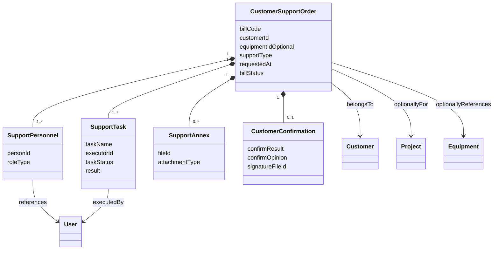
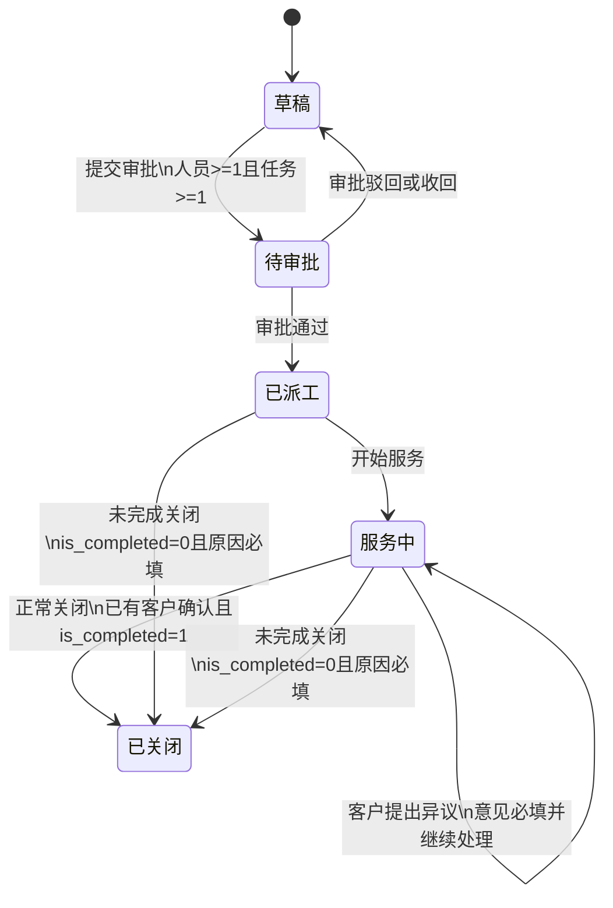

# 客户服务验证详细设计

# 客户服务验证详细设计

> 需求编号：15166  
> 目标版本：V2026.08  
> 设计范围：狭义“客户服务”验证，不包含整个售后模块  
> 实施周期约束：3天验证版  
> 文档状态：待业使用新的来源字段、订单、交易类型  
> order_type_id 订单类型主键  
> order_type_code 订单类型编码  
> order_type_name 订单类型名称  
> transaction_type_id 交易类型  
> transaction_type_code 交易类型编码  
> transaction_type_name 交易类型名称  
> source_id 来源单据id  
> source_transaction_type_id 来源交易类型主键  
> source_bid 来源单据明细主键  
> source_bill_code 来源单据号  
> source_order_type_id 来源订单类型主键  
> source_rowno 来源单据行号  
> first_id 源头单据id  
> first_transaction_type_id 源头交易类型主键  
> first_bid 源头单据明细主键  
> first_bill_code 源头单据号  
> first_order_type_id 源头订单类型  
> first_rowno 源头单据行号  
> 务确认后用于验证，不涉及代码修改  
> 编制日期：2026-07-23

## 1\. 目标与范围

### 1.1 验证目标

本期仅验证客户提出服务需求后，企业安排人员和任务开展服务，服务人员提交处理结果，客户完成确认，最终关闭服务单的最小业务闭环。

本期重点验证以下问题：

1.  一张客户服务单能否准确关联客户并记录服务诉求。
2.  能否为服务单安排一名或多名服务人员。
3.  能否生成并执行服务任务。
4.  服务人员能否填写处理记录并上传附件。
5.  客户能否确认服务结果并留下签名或意见。
6.  系统能否按明确状态控制允许的操作。
7.  能否从客户、服务人员和日期维度追溯历史客户服务。

### 1.2 本期范围

| 范围内 | 说明  |
| --- | --- |
| 客户服务单 | 服务业务的聚合根 |
| 服务人员明细 | 一张服务单可安排多名服务人员 |
| 服务任务明细 | 服务工作内容及完成结果 |
| 服务附件 | 服务前、服务中、服务后的图片或文件 |
| 客户服务确认 | 客户确认结果、意见和签名 |
| 状态流转 | 草稿至关闭的最小生命周期 |
| 基础查询 | 按客户、人员、状态和日期查询 |

### 1.3 明确范围外

以下资料只用于理解客户服务与其他售后业务的边界，不进入本期表结构、页面、状态机和验收：

- 销售机会与客户拜访；
- 客户定期回访；
- 项目进度、内制进度和外采进度；
- 现场安装交付；
- 整机调试和设备点检；
- 设备维修；
- 客户投诉、客户建议；
- 质量分析、责任判定、整改与验证；
- 库存扣减、备件领用和财务结算；
- 工单自动派工、智能排程和移动端离线能力。

## 2\. 设计依据与纪律

### 2.1 来源

| 来源  | 本期用途 |
| --- | --- |
| 用户提供的《通用字段命名规范》 | 本文表字段编码、类型和描述的权威命名依据 |
| CRM 售后领域本体候选资料 | 分析客户服务与人员、任务、附件、确认之间的关系；设备关系仅作边界参考 |
| `caij-cloud-crm-support` 当前实现 | 参考 CJ Cloud 聚合、审批、编码和专项动作的实现习惯 |
| 其他售后模块资料 | 仅作字段命名和关系参考，不视为本期需求 |

当前未提供独立的《客户服务需求说明书》和目标环境元数据归档，因此本设计中的业务码值、必填性和引用档案配置均需在验证前确认。不得把其他售后模块的状态和规则直接套用到客户服务。

### 2.2 落地原则

1.  客户服务是独立聚合，不与整机调试、维修、现场交付共用一张业务主表。
2.  客户、项目和人员均引用系统已有档案，不重复建设主数据；设备仅作为可选上下文。
3.  本期只建设最小闭环所需对象，不建设统一售后中台。
4.  单号使用 CJ Cloud `EncodingUtil` 对应的运行时编码规则，不手拼字符串。
5.  状态、服务类型、任务结果等码值通过运行时档案/字典解析，不在页面或业务代码中硬编码。
6.  元数据建模时由平台生成 DDL 和代码骨架，不手写物理表。
7.  通用语义必须优先采用《通用字段命名规范》中的字段编码，不为同一语义另造字段名。

## 3\. 客户服务领域本体

### 3.1 受控词表

| ID  | 规范名 | 定义  | 易混点 |
| --- | --- | --- | --- |
| `customer-support-order` | 客户服务单 | 对一次客户技术服务过程的完整记录 | 不等同于维修单、调试单或客户回访单 |
| `support-personnel` | 服务人员 | 被安排参与本次服务的内部人员 | 与客户联系人分开 |
| `support-task` | 服务任务 | 本次服务需要完成的工作项 | 与现场任务模板分开 |
| `support-annex` | 服务附件 | 服务过程产生的图片、文档或其他文件 | 不承担结构化任务结果 |
| `customer-confirmation` | 客户服务确认 | 客户对服务结果的确认、异议和签名 | 不等同于内部审批 |
| `business-status` | 业务状态 | 客户服务自身的生命周期 | 不等同于审批状态 |

### 3.2 类

| ID  | 类   | 种类  | 本期处理 |
| --- | --- | --- | --- |
| `cls-customer-support-order` | 客户服务单 | 单据/聚合根 | 新建  |
| `cls-support-personnel` | 服务人员明细 | 组合明细 | 新建  |
| `cls-support-task` | 服务任务明细 | 组合明细 | 新建  |
| `cls-support-annex` | 服务附件 | 组合明细 | 新建  |
| `cls-customer-confirmation` | 客户服务确认 | 组合明细 | 新建  |
| `ref-customer` | 客户档案 | 外部引用 | 复用  |
| `ref-project` | 项目档案 | 外部引用 | 复用，可选 |
| `ref-equipment` | 客户设备档案 | 可选外部引用 | 仅设备相关服务使用 |
| `ref-user` | 人员档案 | 外部引用 | 复用  |

### 3.3 对象关系

| 关系 ID | domain | range | 基数  | 关系  | 实现  |
| --- | --- | --- | --- | --- | --- |
| `rel-order-customer` | 客户服务单 | 客户档案 | n:1 | 关联  | `customer_id` 引用选择器 |
| `rel-order-project` | 客户服务单 | 项目档案 | n:0..1 | 可选关联 | `project_id`；不影响提交 |
| `rel-order-equipment-context` | 客户服务单 | 客户设备档案 | n:0..1 | 可选关联 | 主表 `equipment_id`；非设备服务为空 |
| `rel-order-personnel` | 客户服务单 | 服务人员明细 | 1:n | 组合  | 子表  |
| `rel-personnel-user` | 服务人员明细 | 人员档案 | n:1 | 关联  | `person_id` 引用选择器 |
| `rel-order-task` | 客户服务单 | 服务任务明细 | 1:n | 组合  | 子表  |
| `rel-task-personnel` | 服务任务明细 | 人员档案 | n:1 | 可选关联 | `executor_id` |
| `rel-order-attachment` | 客户服务单 | 服务附件 | 1:n | 组合  | 子表  |
| `rel-order-confirmation` | 客户服务单 | 客户服务确认 | 1:0..1 | 组合  | 子表或一对一明细 |

### 3.4 本体图

### 3.5 能力问题

| CQ  | 问题  | 依赖  |
| --- | --- | --- |
| `CQ-CS-01` | 某客户在指定日期范围内发生过哪些客户服务？ | 客户服务单、客户、申请时间 |
| `CQ-CS-02` | 某项客户服务是否涉及指定设备？ | 客户服务单、可选设备引用 |
| `CQ-CS-03` | 某张服务单由哪些人员负责？ | 服务人员、人员档案 |
| `CQ-CS-04` | 某张服务单还有哪些任务未完成？ | 服务任务、任务状态 |
| `CQ-CS-05` | 哪些服务的必做任务已完成但尚未获得客户确认？ | 服务任务、客户确认、主单状态 |
| `CQ-CS-06` | 客户对某次服务确认还是提出异议？ | 客户服务确认 |
| `CQ-CS-07` | 某服务人员在指定日期范围内完成了哪些服务？ | 服务人员、服务单、完成时间 |

## 4\. 数据模型

### 4.1 公共字段

#### 4.1.1 命名规范解释

- 用户原表中的 `deciamal(18,8)` 按数据库正确类型名统一解释为 `decimal(18,8)`。
- `nvarchar` 长度按用户规范执行；没有给出类型的日期字段，在元数据建模前保持“类型待确认”，不自行推断。
- 新建模型标识禁止使用 `service`；客户服务域统一使用 `support`。单据号统一为 `bill_code`，不另建 `support_no`。
- `start_date`、`end_date` 已是平台系统字段；业务开始/结束时间必须增加业务前缀，避免覆盖系统语义。
- 客户服务本期不涉及金额、税、币种、仓库、库位、批号、物料和计量数量，因此这些通用字段不进入本期5张业务表。
- 若后续增加服务用料，应直接复用规范中的 `item_id`、`main_qty`、`assist_qty`、`main_unit_id`、`assist_unit_id`，不得另造物料和数量字段。

#### 4.1.2 CJ Cloud 3.11.0系统字段

模型设计器可按“审批流、单据号、创建修改、逻辑删除、时间戳、业务流、主键、组织集团、打印记录、版本管理”等能力自动补充系统字段。截图中完整系统字段共28个：

| 字段名称 | Java字段 | 字段编码 | 组件  | Java类型 | 长度  | 关联档案/说明 |
| --- | --- | --- | --- | --- | --- | --- |
| 版本  | version | `version` | 整数  | Integer | 0   | 版本管理 |
| 开始日期 | startDate | `start_date` | 日期  | String | 10  | `yyyy-MM-dd` |
| 结束日期 | endDate | `end_date` | 日期  | String | 10  | `yyyy-MM-dd` |
| 最后打印人名称 | lastPrintUser | `last_print_user` | 普通文本 | String | 40  | 打印记录 |
| 最后一次打印时间 | lastPrintTime | `last_print_time` | 日期时间 | String | 19  | `yyyy-MM-dd HH:mm:ss` |
| 打印次数 | printCount | `print_count` | 整数  | Integer | 0   | 打印记录 |
| 组织主键 | orgId | `org_id` | 单选引用 | String | 32  | 组织管理 |
| 集团主键 | groupId | `group_id` | 普通文本 | String | 32  | 集团隔离 |
| 主键  | id  | `id` | 主键  | String | 32  | 平台主键 |
| 业务流主键 | flowBizId | `flow_biz_id` | 单选引用 | String | 32  | 业务流管理 |
| 业务流名称 | flowBizName | `flow_biz_name` | 普通文本 | String | 200 | 业务流管理 |
| 业务流程版本 | flowBizVersion | `flow_biz_version` | 整数  | Integer | 0   | 业务流版本 |
| 逻辑删除 | dr  | `dr` | 开关  | Integer | 0   | 0正常、1已删除 |
| 时间戳 | ts  | `ts` | 日期时间 | String | 19  | `yyyy-MM-dd HH:mm:ss` |
| 创建人 | creator | `creator` | 单选引用 | String | 32  | 用户管理 |
| 创建时间 | creationTime | `creation_time` | 日期时间 | String | 19  | `yyyy-MM-dd HH:mm:ss` |
| 修改人 | modifier | `modifier` | 单选引用 | String | 32  | 用户管理 |
| 修改时间 | modifiedTime | `modified_time` | 日期时间 | String | 19  | `yyyy-MM-dd HH:mm:ss` |
| 单据号 | billCode | `bill_code` | 单据编码 | String | 40  | 平台编码规则 |
| 流程定义key | procDefKey | `proc_def_key` | 普通文本 | String | 200 | 审批流 |
| 流程定义名称 | procDefName | `proc_def_name` | 普通文本 | String | 200 | 审批流 |
| 审批流ID | approvalId | `approval_id` | 普通文本 | String | 32  | 审批流 |
| 流程实例主键 | procInstId | `proc_inst_id` | 主键  | String | 200 | 审批实例 |
| 发起人 | initiator | `initiator` | 单选引用 | String | 32  | 用户管理 |
| 发起时间 | initiatorTime | `initiator_time` | 日期时间 | String | 19  | `yyyy-MM-dd HH:mm:ss` |
| 审批人 | approver | `approver` | 单选引用 | String | 32  | 用户管理 |
| 审批时间 | approverTime | `approver_time` | 日期时间 | String | 19  | `yyyy-MM-dd HH:mm:ss` |
| 审批状态 | accraditationStatus | `accraditation_status` | 单选  | Integer | 0   | 审批状态档案 |

客户服务主表是审批单据，应启用上述28个系统字段。明细表只启用其实际需要的主键、组织集团、逻辑删除、时间戳及创建修改字段，不应给每张明细重复添加审批流字段。

#### 4.1.3 主表业务通用字段

| 字段  | 类型  | 描述  | 客户服务使用 |
| --- | --- | --- | --- |
| `bill_code` | `nvarchar(40)` | 单据号 | 是   |
| `bill_status` | `int` | 单据状态 | 是   |
| `dept_id` | `nvarchar(32)` | 部门主键 | 是   |
| `customer_id` | `nvarchar(32)` | 客户主键 | 是   |
| `bill_maker` | `nvarchar(32)` | 单据制单人 | 是   |
| `dmake_date` | `nvarchar(10)` | 单据日期 | 是   |
| `closed_status` | `int` | 关闭状态，0打开、1关闭 | 是   |
| `closed_cause` | `nvarchar(200)` | 关闭原因 | 是   |
| `closed_time` | `nvarchar(19)` | 关闭时间 | 是   |
| `closed_person` | `nvarchar(200)` | 关闭人 | 是   |
| `memo` | `nvarchar(1000)` | 备注  | 是   |
| `deleter` | `nvarchar(32)` | 删除人 | 由平台删除机制决定 |
| `deleter_time` | `nvarchar(19)` | 删除时间 | 由平台删除机制决定 |

#### 4.1.4 子表业务通用字段

| 字段  | 类型  | 描述  | 客户服务使用 |
| --- | --- | --- | --- |
| `row_no` | `nvarchar(40)` | 行号  | 是   |
| `row_status` | `int` | 行状态 | 是   |
| `description` | `nvarchar(1000)` | 描述  | 按明细语义使用 |
| `memo` | `nvarchar(1000)` | 备注  | 是   |
| `project_id` | `nvarchar(32)` | 项目号主键 | 仅有项目维度时使用 |
| `sn_id` | `nvarchar(32)` | 序列号主键 | 设备档案存在独立序列号引用时使用 |
| `task_id` | `nvarchar(32)` | 任务号主键 | 附件关联任务时使用 |

#### 4.1.5 自定义预留字段

模型设计器可一次性补充60个自定义预留字段：

| 字段范围 | 数量  | 设计器默认组件/Java类型 | 使用纪律 |
| --- | --- | --- | --- |
| `ndef1`～`ndef20` | 20  | 金额/BigDecimal | 仅在正式业务字段不足且已完成元数据语义登记时使用 |
| `sdef1`～`sdef40` | 40  | 字符类预留字段 | 仅在正式业务字段不足且已完成元数据语义登记时使用 |

预留字段是平台扩展能力，不代表客户服务必须创建或使用60个字段。验证版优先建立有明确业务语义的正式字段，禁止把 `ndef/sdef` 当作无定义的临时存储区。

#### 4.1.6 订单、交易类型与来源追溯字段

来源字段采用“当前单据 → 直接来源 → 最初源头”三层结构，替代旧的 `source_type/source_bill_id` 简化设计。

当前单据类型：

| 字段编码 | 建议类型 | 描述  |
| --- | --- | --- |
| `order_type_id` | `nvarchar(32)` | 订单类型主键 |
| `order_type_code` | `nvarchar(40)` | 订单类型编码 |
| `order_type_name` | `nvarchar(200)` | 订单类型名称 |
| `transaction_type_id` | `nvarchar(32)` | 交易类型主键 |
| `transaction_type_code` | `nvarchar(40)` | 交易类型编码 |
| `transaction_type_name` | `nvarchar(200)` | 交易类型名称 |

直接来源：

| 字段编码 | 建议类型 | 描述  |
| --- | --- | --- |
| `source_id` | `nvarchar(32)` | 来源单据主表ID |
| `source_transaction_type_id` | `nvarchar(32)` | 来源交易类型主键 |
| `source_bid` | `nvarchar(32)` | 来源单据明细主键 |
| `source_bill_code` | `nvarchar(40)` | 来源单据号 |
| `source_order_type_id` | `nvarchar(32)` | 来源订单类型主键 |
| `source_rowno` | `nvarchar(40)` | 来源单据行号 |

最初源头：

| 字段编码 | 建议类型 | 描述  |
| --- | --- | --- |
| `first_id` | `nvarchar(32)` | 源头单据主表ID |
| `first_transaction_type_id` | `nvarchar(32)` | 源头交易类型主键 |
| `first_bid` | `nvarchar(32)` | 源头单据明细主键 |
| `first_bill_code` | `nvarchar(40)` | 源头单据号 |
| `first_order_type_id` | `nvarchar(32)` | 源头订单类型主键 |
| `first_rowno` | `nvarchar(40)` | 源头单据行号 |

使用规则：

1.  客户服务单始终保存自身的订单类型和交易类型三元组（ID、编码、名称）。
2.  手工新增且没有上游单据时，直接来源与最初源头字段允许为空。
3.  由其他业务单据生成时，必须保存直接来源字段。
4.  上游单据本身已有来源链时，必须将其最初源头字段透传到客户服务单，不得把直接来源错误覆盖为最初源头。
5.  由来源主表生成时，`source_bid/source_rowno/first_bid/first_rowno` 允许为空；由来源明细行生成时必须填写。
6.  ID、编码、名称为同一业务对象的引用与快照，不允许只写名称而缺少ID。
7.  来源字段创建后原则上不可人工修改；来源单删除或改名不回写历史快照。

物理表由平台元数据生成。除本节已明确的通用字段外，业务字段的长度、默认值和索引在元数据建模时确认。

### 4.2 客户服务单 `crm_customer_support`

客户服务主表按审批单据建模，继承4.1.2中的全部28个系统字段，尤其必须包含以下审批流字段：

| 字段编码 | 类型  | 用途  |
| --- | --- | --- |
| `proc_def_key` | `nvarchar(200)` | 流程定义key |
| `proc_def_name` | `nvarchar(200)` | 流程定义名称 |
| `approval_id` | `nvarchar(32)` | 审批流ID |
| `proc_inst_id` | `nvarchar(200)` | 流程实例主键 |
| `initiator` | `nvarchar(32)` | 发起人 |
| `initiator_time` | `nvarchar(19)` | 发起时间 |
| `approver` | `nvarchar(32)` | 审批人 |
| `approver_time` | `nvarchar(19)` | 审批时间 |
| `accraditation_status` | `int` | 框架审批状态 |

这些字段由审批框架维护，页面通常只读展示，不由客户服务业务规则任意改写。

客户服务主表作为可打印单据，还必须启用打印记录公共字段：

| 字段编码 | 类型  | 用途  |
| --- | --- | --- |
| `last_print_user` | `nvarchar(40)` | 最后打印人名称 |
| `last_print_time` | `nvarchar(19)` | 最后一次打印时间，格式 `yyyy-MM-dd HH:mm:ss` |
| `print_count` | `int` | 累计打印次数 |

打印成功后由打印能力统一回写上述字段；普通保存、审批和状态流转不得重置打印次数。

| 字段  | 逻辑类型 | 必填  | 说明  |
| --- | --- | --- | --- |
| `bill_code` | `nvarchar(40)` | 是   | 客户服务单号；平台编码规则生成 |
| `bill_status` | `int` | 是   | 客户服务业务状态 |
| `dept_id` | `nvarchar(32)` | 是   | 服务责任部门主键 |
| `bill_maker` | `nvarchar(32)` | 是   | 单据制单人 |
| `dmake_date` | `nvarchar(10)` | 是   | 单据日期 |
| `support_type` | 枚举  | 是   | 服务类型；运行时档案 |
| `order_type_id/code/name` | 见4.1.6 | 是   | 当前客户服务订单类型三元组 |
| `transaction_type_id/code/name` | 见4.1.6 | 是   | 当前客户服务交易类型三元组 |
| `source_*` | 见4.1.6 | 否   | 直接来源；手工新增可空 |
| `first_*` | 见4.1.6 | 否   | 最初源头；无上游可空 |
| `customer_id` | `nvarchar(32)` | 是   | 客户档案主键 |
| `customer_code` | `nvarchar(40)` | 是   | 客户编码快照 |
| `customer_name` | 字符串 | 是   | 客户名称快照 |
| `project_id` | `nvarchar(32)` | 否   | 项目号主键；客户服务只要求关联客户，项目可空 |
| `project_code` | `nvarchar(40)` | 否   | 项目号编码快照 |
| `project_name` | 字符串 | 否   | 项目名称快照 |
| `equipment_id` | `nvarchar(32)` | 否   | 可选设备主键；仅设备相关客户服务填写 |
| `equipment_code` | `nvarchar(40)` | 否   | 可选设备编码快照 |
| `equipment_name` | 字符串 | 否   | 可选设备名称快照 |
| `support_address` | 字符串 | 是   | 服务地址 |
| `customer_contact` | 字符串 | 是   | 客户联系人 |
| `contact_phone` | 字符串 | 是   | 联系电话 |
| `request_description` | 长文本 | 是   | 客户需求/问题描述 |
| `urgency_level` | 枚举  | 是   | 紧急程度 |
| `planned_support_time` | `nvarchar(19)` | 否   | 计划服务时间 |
| `support_start_time` | `nvarchar(19)` | 否   | 实际开始服务时间 |
| `support_end_time` | `nvarchar(19)` | 否   | 工程师完成服务时间 |
| `customer_confirm_time` | `nvarchar(19)` | 否   | 客户确认时间 |
| `satisfaction_score` | `int` | 否   | 客户满意度评分，5分制整数，取值1～5 |
| `is_completed` | `int` | 是   | 完成标识，0未完成、1已完成 |
| `closed_status` | `int` | 是   | 0打开、1关闭 |
| `closed_cause` | `nvarchar(200)` | 否   | 关闭原因 |
| `closed_time` | `nvarchar(19)` | 否   | 关闭时间 |
| `closed_person` | `nvarchar(200)` | 否   | 关闭人 |
| `memo` | `nvarchar(1000)` | 否   | 备注  |

业务约束：

- `bill_code` 在组织范围内唯一；
- 新增时状态为草稿；
- 当前订单类型、交易类型由客户服务功能入口和运行配置确定，不允许用户随意改写；
- 从上游生成时必须按4.1.6保存直接来源和最初源头；
- 客户 ID、编码、名称快照必须同时写入；
- 项目不是提交必填项，只关联客户即可创建和提交；
- 设备引用不参与提交必填校验；填写设备 ID 时同步保存设备名称快照；
- 服务人员和服务任务至少各一行后才允许提交；
- 正常完成时，关闭前必须存在客户确认记录且结果为确认；
- 未完成关闭时写 `is_completed=0`，并要求 `closed_cause` 必填。

### 4.3 服务人员明细 `crm_customer_support_personnel`

| 字段  | 逻辑类型 | 必填  | 说明  |
| --- | --- | --- | --- |
| `support_id` | 主表ID | 是   | 客户服务单 ID |
| `row_no` | `nvarchar(40)` | 是   | 行号  |
| `row_status` | `int` | 是   | 行状态 |
| `person_id` | `nvarchar(32)` | 是   | 人员档案主键 |
| `person_code` | `nvarchar(40)` | 是   | 人员编码快照 |
| `person_name` | 字符串 | 是   | 人员名称快照 |
| `role_type` | 枚举  | 是   | 负责人/参与人 |
| `is_leader` | 布尔  | 是   | 是否服务负责人 |
| `work_hours` | `decimal(18,8)` | 否   | 服务工时；支持记录但不必填 |
| `description` | `nvarchar(1000)` | 否   | 计划工作内容描述 |
| `memo` | `nvarchar(1000)` | 否   | 备注  |

约束：

- 同一服务单至少一名服务人员；
- 同一服务单只能有一名负责人；
- `support_id + person_id` 不重复。

### 4.4 服务任务明细 `crm_customer_support_task`

| 字段  | 逻辑类型 | 必填  | 说明  |
| --- | --- | --- | --- |
| `support_id` | 主表ID | 是   | 客户服务单 ID |
| `row_no` | `nvarchar(40)` | 是   | 行号  |
| `row_status` | `int` | 是   | 行状态 |
| `task_id` | `nvarchar(32)` | 是   | 现场任务设置主键 |
| `task_code` | `nvarchar(40)` | 是   | 现场任务设置编码快照 |
| `task_name` | 字符串 | 是   | 任务名称 |
| `description` | `nvarchar(1000)` | 是   | 任务内容描述 |
| `executor_id` | `nvarchar(32)` | 否   | 执行人员主键 |
| `executor_code` | `nvarchar(40)` | 否   | 执行人员编码快照 |
| `executor_name` | 字符串 | 否   | 执行人员名称快照 |
| `mandatory` | 布尔  | 是   | 是否必做 |
| `task_status` | 枚举  | 是   | 未开始/进行中/已完成 |
| `task_start_time` | `nvarchar(19)` | 否   | 任务开始时间 |
| `task_end_time` | `nvarchar(19)` | 否   | 任务完成时间 |
| `support_result` | 长文本 | 否   | 服务处理结果 |
| `follow_up_required` | 布尔  | 是   | 是否需要后续处理 |
| `follow_up_plan` | 长文本 | 否   | 后续计划 |
| `memo` | `nvarchar(1000)` | 否   | 备注  |

约束：

- 新建服务单时，从 `crm_site_task_setting` 中默认带入 `task_type=4`（客户服务）的有效任务；
- 服务单至少包含一项任务；
- 任务完成时必须填写完成时间和服务结果；
- 必做任务未完成时不得提交客户确认；
- `follow_up_required=是` 时必须填写后续计划。

### 4.5 服务附件 `crm_customer_support_annex`

| 字段  | 逻辑类型 | 必填  | 说明  |
| --- | --- | --- | --- |
| `support_id` | 主表ID | 是   | 客户服务单 ID |
| `row_no` | `nvarchar(40)` | 是   | 行号  |
| `row_status` | `int` | 是   | 行状态 |
| `task_id` | `nvarchar(32)` | 否   | 任务号主键 |
| `attachment_type` | 枚举  | 是   | 服务前/服务中/服务后/其他 |
| `file_id` | 文件ID | 是   | 文件服务返回 ID |
| `file_name` | 字符串 | 是   | 文件名 |
| `file_path` | 字符串 | 是   | 文件路径 |
| `file_type` | 字符串 | 否   | MIME或扩展类型 |
| `file_size` | 整数  | 否   | 文件大小 |
| `description` | `nvarchar(1000)` | 否   | 附件说明 |
| `memo` | `nvarchar(1000)` | 否   | 备注  |

验证版只验证附件登记和查询，不设计分片上传、版本和打印管理。单个附件最大20MB，不限制文件格式和附件数量。

### 4.6 客户服务确认 `crm_customer_support_confirmation`

| 字段  | 逻辑类型 | 必填  | 说明  |
| --- | --- | --- | --- |
| `support_id` | 主表ID | 是   | 客户服务单 ID |
| `row_no` | `nvarchar(40)` | 是   | 行号  |
| `row_status` | `int` | 是   | 行状态 |
| `confirm_result` | 枚举  | 是   | 确认/有异议 |
| `description` | `nvarchar(1000)` | 否   | 客户确认意见 |
| `customer_contact` | 字符串 | 是   | 确认人 |
| `contact_phone` | 字符串 | 否   | 联系电话 |
| `signature_file_id` | 文件ID | 是   | 客户签名文件 |
| `signature_file_path` | 字符串 | 是   | 签名文件路径 |
| `confirm_time` | `nvarchar(19)` | 是   | 确认时间 |
| `memo` | `nvarchar(1000)` | 否   | 备注  |

约束：

- 一张服务单最多一条有效确认记录；
- 确认结果为“有异议”时，确认意见必填；
- 客户签名必填；
- 有异议时服务单不能关闭，应回到服务中处理。

## 5\. 状态机

### 5.1 审批状态与业务状态

客户服务同时存在两套状态：

- `accraditation_status`：CJ Cloud审批框架状态，表示未提交、审批中、审批通过、驳回等。
- `bill_status`：客户服务业务状态，复用系统预置档案 `fieldServiceStatus`。

审批框架状态以目标环境“审批状态”档案为准：

| `accraditation_status` | 含义  |
| --- | --- |
| 0   | 审批不通过 |
| 1   | 保存  |
| 2   | 审核中 |
| 3   | 审批通过 |
| 4   | 已驳回 |
| 5   | 待审核 |
| 6   | 已退回 |
| 7   | 已收回 |
| 8   | 已失效 |

上述9个码值来自目标环境档案截图。档案不是系统预置固定常量，页面显示和规则判断应在运行时读取审批状态档案；不得另建一套客户服务审批状态，也不得用 `bill_status` 替代。

`bill_status` 的码值已由系统预置档案 `fieldServiceStatus` 确定。页面和规则运行时读取该档案，不再新建客户服务专用状态档案。

### 5.2 业务状态定义

| `bill_status` | 档案名称 | 含义  |
| --- | --- | --- |
| 1   | 草稿  | 服务单正在录入，尚未提交 |
| 2   | 待审批 | 已提交审批，等待审批结果 |
| 3   | 已派工 | 审批已通过，人员和任务已安排，等待开始 |
| 4   | 服务中 | 服务执行、工程师完成、客户确认或异议均在此阶段处理 |
| 5   | 已关闭 | 服务流程结束；通过 `is_completed` 区分正常完成和未完成关闭 |

客户确认和客户异议使用确认记录表达，不扩充 `fieldServiceStatus` 档案：

- 客户确认：新增确认记录，`confirm_result=确认`，主单保持服务中，随后允许正常关闭。
- 客户异议：新增/更新确认记录，`confirm_result=有异议`，主单保持服务中，继续处理任务。
- 作废/删除：审批通过前按逻辑删除及审批撤回规则处理，不占用新的 `bill_status` 码值。

### 5.3 状态迁移

### 5.4 状态动作矩阵

| 当前状态 | 可编辑主单 | 可编辑任务 | 允许动作 |
| --- | --- | --- | --- |
| 草稿  | 是   | 是   | 保存、提交审批、删除/作废 |
| 待审批 | 否   | 否   | 审批、收回 |
| 已派工 | 客户不可改、设备可补 | 是   | 开始服务、未完成关闭 |
| 服务中 | 客户不可改、设备可补 | 是   | 完成任务、工程师完成、客户确认、客户异议、正常/未完成关闭 |
| 已关闭 | 否   | 否   | 查看；通过 `is_completed` 区分完成/未完成 |

## 6\. 业务规则

| 规则 ID | 触发动作 | 规则  | 异常消息 |
| --- | --- | --- | --- |
| `CS-R01` | 新增  | 单号为空时通过平台编码规则生成 | `客户服务单号生成失败：<原因>` |
| `CS-R02` | 新增  | 从现场任务设置默认带入“客户服务”分类的有效任务 | 无有效设置时提示 `未配置客户服务任务` |
| `CS-R03` | 提交审批 | 至少一名服务人员且仅一名负责人 | `客户服务单必须指定一名服务负责人` |
| `CS-R04` | 提交审批 | 至少一项服务任务 | `客户服务单至少需要一项服务任务` |
| `CS-R05` | 审批通过 | 写 `bill_status=3`（已派工）；审批通过后禁止删除和作废 | `审批通过的客户服务单不允许删除或作废` |
| `CS-R06` | 开始服务 | 仅 `bill_status=3` 可执行，写 `bill_status=4` | `只有已派工状态的客户服务单允许开始服务` |
| `CS-R07` | 完成任务 | 完成时间和服务结果必填 | `任务完成时必须填写完成时间和服务结果` |
| `CS-R08` | 工程师完成 | 所有必做任务已完成；主单保持 `bill_status=4` | `仍有必做任务未完成` |
| `CS-R09` | 工程师完成 | 需要后续处理的任务已填写后续计划 | `需要后续处理的任务必须填写后续计划` |
| `CS-R10` | 客户确认 | 签名文件必填 | `客户确认必须上传签名` |
| `CS-R11` | 客户异议 | 确认意见必填，主单保持 `bill_status=4` | `客户提出异议时必须填写意见` |
| `CS-R12` | 正常关闭 | `bill_status=4` 且存在有效确认记录；写 `bill_status=5,is_completed=1` | `只有客户已确认的服务单允许正常关闭` |
| `CS-R13` | 未完成关闭 | `bill_status∈{3,4}` 且关闭原因必填；写 `bill_status=5,is_completed=0` | `未完成关闭必须填写关闭原因` |
| `CS-R14` | 删除/作废 | 仅审批通过前允许；作废不发起审批 | `审批通过的客户服务单不允许删除或作废` |
| `CS-R15` | 修改  | 提交审批后客户不可修改；设备允许后补 | `已提交的客户服务单不允许修改客户` |
| `CS-R16` | 新增/转单 | 当前订单类型和交易类型三元组必须完整 | `客户服务订单类型或交易类型配置不完整` |
| `CS-R17` | 上游生成 | 直接来源必填；已有源头时透传最初源头 | `客户服务来源信息不完整` |

### 6.1 规则落点

若后续进入建造阶段：

- 新增、修改、删除及通用校验进入客户服务 `BusinessService` 的 `biz/rule`；
- 提交审批、开始服务、工程师完成、客户确认、客户异议、正常关闭和未完成关闭为专项业务动作；
- 同一主单只使用一套业务逻辑方式，避免规则类与重写 `saveBill/updateBill` 重复执行；
- 规则需要引用其他 Service 时使用 `SpringContextUtils.getBean(...)`。

本文只定义规则，不实施代码。

## 7\. 功能设计

### 7.1 客户服务列表

查询条件：

- 服务单号；
- 客户；
- 可选设备（仅设备相关服务查询时使用）；
- 服务类型；
- 服务人员；
- 业务状态；
- 申请日期范围；
- 计划服务日期范围。

列表字段：

- 服务单号；
- 客户名称；
- 项目名称；
- 服务类型；
- 紧急程度；
- 服务负责人；
- 计划开始时间；
- 当前状态；
- 创建人和创建时间。

操作按状态动态显示：新增、查看、编辑、提交审批、开始服务、工程师完成、客户确认、正常关闭、未完成关闭、作废。

### 7.2 客户服务表单

建议使用主子元数据页面：

1.  基本信息：客户、可选项目、可选设备、地址、联系人、需求描述、紧急程度。
2.  服务人员页签：人员、角色、负责人标记。
3.  服务任务页签：任务、执行人、完成状态和结果。
4.  服务附件页签：图片和文件。
5.  客户确认区域：确认结果、意见、确认人、签名。

订单类型、交易类型、直接来源和最初源头字段由系统赋值，默认只读；手工新增且无来源时不展示空的来源信息。

### 7.3 专项动作

| 动作  | 输入  | 写入  |
| --- | --- | --- |
| 提交审批 | 服务单 ID | 校验明细，写 `bill_status=2` 并发起审批 |
| 审批通过 | 审批结果 | 写 `bill_status=3`，之后禁止删除/作废 |
| 开始服务 | 服务单 ID | 实际开始时间、状态转服务中 |
| 完成任务 | 任务 ID、结果、附件可选 | 任务状态和完成时间 |
| 工程师完成 | 服务单 ID | 写工程师完成时间，主单保持 `bill_status=4` |
| 客户确认 | 结果、意见、签名、满意度可选 | 写确认记录；主单保持 `bill_status=4` |
| 继续处理 | 服务单 ID | 有异议时继续维护任务，主单保持 `bill_status=4` |
| 正常关闭 | 服务单 ID | 写 `bill_status=5,closed_status=1,is_completed=1` 及关闭人、时间 |
| 未完成关闭 | 服务单 ID、关闭原因 | 写 `bill_status=5,closed_status=1,is_completed=0` 及关闭信息 |
| 作废  | 服务单 ID、原因 | 审批通过前直接作废，不发起审批 |

## 8\. 主数据与引用

| 字段  | 引用对象 | 选择方式 | 本期要求 |
| --- | --- | --- | --- |
| `customer_id/code/name` | 客户档案 `sys_customer_profile` | 单选、必填 | `valueKey=id`、`labelKey=name`；保存ID、编码、名称，提交后不可修改 |
| `project_id/code/name` | 项目号档案 `bd_project` | 单选、可选 | `valueKey=id`、`labelKey=name`；保存ID、编码、名称，不影响提交 |
| `equipment_id/code/name` | 设备档案 `bd_em` | 可选单选 | `valueKey=id`、`labelKey=name`；保存ID、编码、名称，可后补 |
| `person_id/code/name`、`executor_id/code/name` | 人员档案 `bd_person` | 单选  | `valueKey=id`、`labelKey=name`；保存ID、编码、名称 |
| `task_id/code/name` | 现场任务设置 `crm_site_task_setting` | 默认带入 | `valueKey=id`、`labelKey=name`；过滤 `task_type=4`（客户服务） |
| `support_type` | 服务类型档案 | 单选  | 不使用 Java 硬编码枚举 |
| `urgency_level` | 紧急程度档案 | 单选  | 不使用 Java 硬编码枚举 |
| 各状态字段 | 状态档案 | 单选/只读显示 | 按专项动作写入 |

引用选择器中的 `valueKey` 是保存到业务表的字段，统一取档案 `id`；`labelKey` 是页面展示字段，统一取档案 `name`。档案 `code` 不作为选择器返回值，但与 `name` 一起保存为业务快照，形成 `id/code/name` 三元组。

已确认 metaCode：设备 `bd_em`、人员 `bd_person`、项目号 `bd_project`、客户 `sys_customer_profile`、现场任务设置 `crm_site_task_setting`。

## 9\. 页面运行契约

验证页上线前必须满足：

1.  客户服务订单类型已创建并能解析到唯一 designer；
2.  页面存在默认排序方案和默认高级搜索方案；
3.  `designerHis` 当前版本有效；
4.  菜单通过启用、租户权益、机构授权、职责四道可见性检查；
5.  引用选择器能通过已确认 metaCode 加载客户、项目、设备和人员；
6.  列表、新增、修改页面无 `success:false` 和 dpage 渲染异常；
7.  状态档案在运行时加载，页面不保存硬编码码值映射；
8.  发布或修改后按治理要求刷新元数据缓存。

## 10\. 三天验证计划

### 第1天：模型与基础页面

- 确认5个实体及字段、审批与业务状态分工；
- 确认状态、服务类型、紧急程度档案；
- 完成客户服务聚合元数据建模；
- 生成并检查平台 DDL；
- 建立主子页面基础结构；
- 打通 `sys_customer_profile`、`bd_person`、`bd_project`、`bd_em` 引用。

### 第2天：状态与核心规则

- 配置编码规则；
- 验证任务按“客户服务”分类默认带入；
- 实现/验证提交审批、审批通过、开始服务、任务完成、工程师完成；
- 验证必做任务和后续计划规则；
- 完成附件和客户签名登记；
- 验证状态按钮权限。

### 第3天：客户确认与回归

- 验证客户确认和客户异议分支；
- 验证继续处理、正常关闭和未完成关闭；
- 验证按客户、人员和状态查询；
- 验证主子数据、组织隔离和逻辑删除；
- 完成真实浏览器回归并记录待办。

若仅做概念和页面原型验证，可不实现全部后台专项动作；但必须明确哪些按钮为演示、哪些已形成真实状态闭环，不得伪造成功结果。

## 11\. 验收用例

| 用例  | 操作  | 预期  |
| --- | --- | --- |
| `CS-AT-01` | 不选择项目和设备，人员和任务完整后提交审批 | 正常提交，`bill_status=2`待审批 |
| `CS-AT-02` | 未指定负责人后提交 | 拒绝并提示指定负责人 |
| `CS-AT-03` | 审批通过 | `bill_status=3`已派工，禁止删除和作废 |
| `CS-AT-04` | 已派工服务单开始服务 | 写实际开始时间，`bill_status=4`服务中 |
| `CS-AT-05` | 未完成必做任务时工程师完成 | 拒绝并提示仍有必做任务 |
| `CS-AT-06` | 完成全部必做任务 | 允许客户确认，主单保持服务中 |
| `CS-AT-07` | 客户确认但未上传签名 | 拒绝  |
| `CS-AT-08` | 客户确认并上传签名 | 生成确认记录，主单保持服务中并允许正常关闭 |
| `CS-AT-09` | 客户提出异议但不填意见 | 拒绝  |
| `CS-AT-10` | 客户提出异议并填写意见 | 保存异议，主单保持服务中 |
| `CS-AT-11` | 异议单继续处理 | 可继续修改和完成任务 |
| `CS-AT-12` | 已有有效客户确认的服务单正常关闭 | 写 `bill_status=5,is_completed=1` 和关闭信息 |
| `CS-AT-13` | 未完成服务单填写原因后关闭 | 写 `is_completed=0` 和关闭原因 |
| `CS-AT-14` | 已提交服务单修改客户、后补设备 | 拒绝修改客户；允许后补设备 |
| `CS-AT-15` | 不同组织查询同一客户 | 只返回当前组织数据 |
| `CS-AT-16` | 新建服务单 | 默认带入现场任务设置中“客户服务”分类任务 |
| `CS-AT-17` | 上传20MB以内任意格式附件 | 上传成功；超过20MB被拒绝 |
| `CS-AT-18` | 录入人员工时和满意度 | 可保存；留空也可继续流程 |
| `CS-AT-19` | 从功能入口手工新增 | 自动写当前订单类型和交易类型；来源字段为空 |
| `CS-AT-20` | 从上游主单生成客户服务 | 写直接来源主表信息；来源行字段为空 |
| `CS-AT-21` | 从有源头的上游明细生成 | 写直接来源行信息并透传最初源头，不混淆两层 |

## 12\. 已确认结论与剩余待确认项

### 12.1 已确认结论

1.  只关联客户即可，项目为可选。
2.  允许多名人员参与，且负责人唯一。
3.  客户确认必须签名。
4.  客户提出异议后回到服务中继续处理。
5.  新建独立客户服务模型，不复用现有现场服务模型。
6.  metaCode：设备 `bd_em`、人员 `bd_person`、项目号 `bd_project`、客户 `sys_customer_profile`。
7.  附件表后缀使用 `_annex`。
8.  服务任务从现场任务设置默认带入，筛选“客户服务”分类。
9.  人员工时支持记录但不必填。
10. 单个附件限制20MB，不限制格式和数量。
11. 满意度支持记录但不必填。
12. 提交后不允许修改客户，允许后补设备。
13. 作废不审批；审批通过后不允许作废或删除，只能关闭。
14. 未完成关闭必须标记未完成并记录关闭原因。
15. `bill_status` 复用系统预置档案 `fieldServiceStatus`：1草稿、2待审批、3已派工、4服务中、5已关闭。
16. 现场任务设置 metaCode为 `crm_site_task_setting`，客户服务任务分类码值为4。
17. 档案引用统一 `valueKey=id`、`labelKey=name`，业务表保存 `id/code/name` 三元组。
18. 满意度采用5分制整数，允许为空，填写时范围为1～5。

### 12.2 P0剩余待确认

当前业务建模所需P0问题已全部确认。后续仅需在目标环境验证各档案实际返回对象中确实包含 `id/code/name` 三个属性；若个别档案字段名不同，应调整该引用的运行时映射，不修改业务语义。

## 13\. 三天范围控制

为了保证验证可以在3天内完成，本期不做：

- 统一售后服务单抽象；
- 调试、维修、投诉数据迁移；
- 自动派工和日历排程；
- 消息通知；
- 库存和用料联动；
- 费用结算；
- 多轮客户确认历史；
- 复杂审批流；
- 移动端专用页面；
- 数据看板和统计报表。

任何新增需求先判断是否直接影响“创建—执行—客户确认—关闭”主闭环；不影响主闭环的进入后续迭代。

## 14\. 可追溯结论

| 设计内容 | 本体来源 |
| --- | --- |
| 客户服务主单 | `customer-support-order` |
| 人员明细 | `rel-order-personnel` |
| 任务明细 | `rel-order-task` |
| 附件（`_annex`） | `rel-order-attachment` |
| 客户确认 | `rel-order-confirmation` |
| 按客户查询 | `rel-order-customer`、`CQ-CS-01` |
| 可选设备上下文 | `rel-order-equipment-context`、`CQ-CS-02` |
| 未完成任务查询 | `rel-order-task`、`CQ-CS-04` |
| 待客户确认查询 | 已完成必做任务且无有效确认记录、`CQ-CS-05` |

本文只描述客户服务验证闭环。其他售后领域对象没有派生为本期表、页面、规则或验收项。